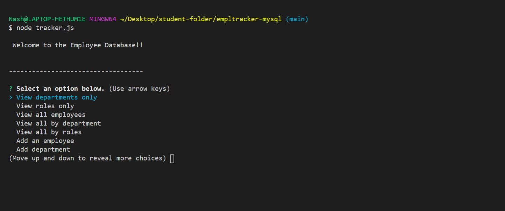
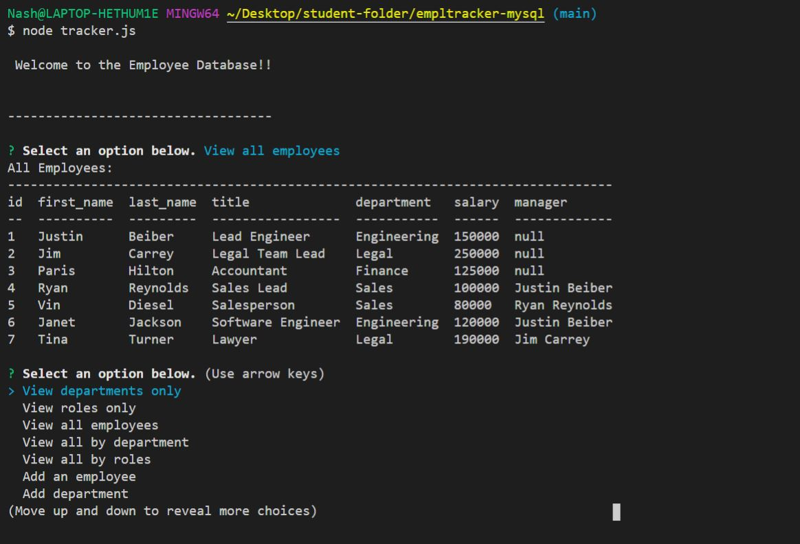
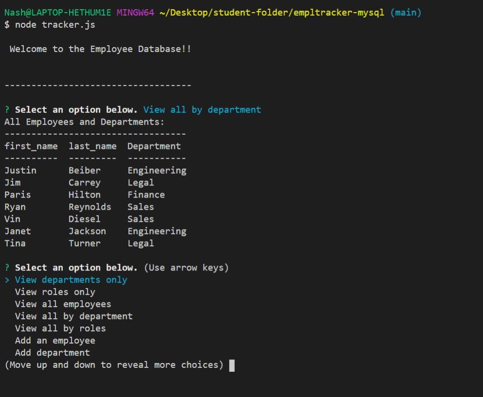

# Employee Tracker
This is a command-line application.

 <a href=""></a>
 <a href=""></a>

## Table of Contents
* [Description](#description)
* [Installation](#installation)
  * [Dependencies](#dependencies)
* [Usage](#usage)
  * [Demo](#Demo)
  * [Screenshots](#screenshots)
  * [Tips](#tips)
* [Contributing](#contributing)
* [Questions](#questions)
* [Credits](#credits)
* [License](#license)

## Description
Employee Tracker is a command-line applicationthat allows its users to view and manager the department, roles and employees in a company. This is useful as it allows the user to organize and plan their business. The application is built on MySQL and can be scaled appropriatley with a companies growth without reconfiguring the core structure of the internal employee data base. This application can act as a foundation to continue to build upon. Employee allows managers or someone within the company to view all employees, roles, as well as departments.

## Installation
<a href=""></a>


Node.js, MYSQl and MYSQL workbench are required. Please clink on the links below for installation information.

* [Node.js](https://nodejs.org/en/download/)
* [MYSQL](https://www.mysql.com/downloads/)
* [MYSQL WORKBENCH](https://dev.mysql.com/downloads/workbench/)

#### Dependencies
* [Inquirer](https://www.npmjs.com/package/inquirer)
* [MYSQL](https://www.npmjs.com/package/mysql)
* [Console.Table](https://www.npmjs.com/package/console.table)

## Usage
This command-line application allows the user to:
  * Add departments, roles, employees
  * View departments, roles, employees
  * Update employee roles
  
 ## Please note MYSQL and MYSQL workbench is required. 
  
In order to use this application you will need to first run an npm install in your CLI to install the dependencies that have been loaded into the json files for you. Once this is done, run node tracker.js in your CLI to start the prompts that will walk you through the verious tasks you can perform with this application.
 
#### Demo
[Click here to view Demo](https://drive.google.com/file/d/16dwwwVE6xRvsnXml1t5CjWDGyz78pw5W/view)
 
#### Screenshots




#### Tips
1. You are able to clone this repo or download a zip file to your local machine.

2. If you have cloned a repo and a package.json exists, you are able to see the dependencies and dev dependecies used in the application. If this is the case run the below comand to get all the depencies need for that application.
```
$ npm i
```
3. MySQL and MYSQL workbench is required.

## Contributing
<a href=""></a>

Please first discuss the change you wish to make via issue or email, before making a change.

Steps to contribute: 
1. Fork the repo on GitHub.
2. Clone the project to your own machine.
3. Commit changes to your own branch.
4. Push your work back up to your fork/branch
5. Submit a Pull Request so that we can review your changes

## Questions  
<a href="https://github.com/nashwalters"></a>

If you have any questions, I can be reached via:
* <bold>Email</bold>: nash.walters@outlook.com

## Credits
* [Adam Simonini](https://github.com/adamsimonini)

## License
<a href=""></a>

Copyright © 2021 Nash Walters,

Released under the [MIT](https://github.com/nashwalters/eng-team-generator/blob/main/LICENSE) license.
